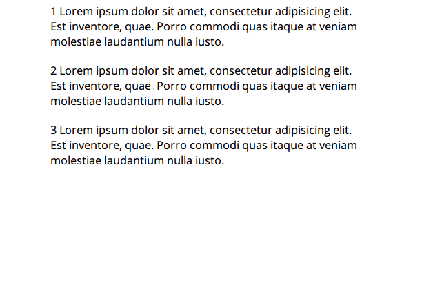

## Get Selected Text

Cross-browser implementation to get the selected text. Tested on IE8, Chrome, and Firefox.

### Note
I use `innerHTML` and DOM 0 `onmouseup` in the demo to show the selected text because I don't want to deal with compatibility issues of IE8.

### Demo

