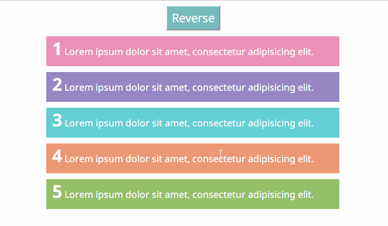
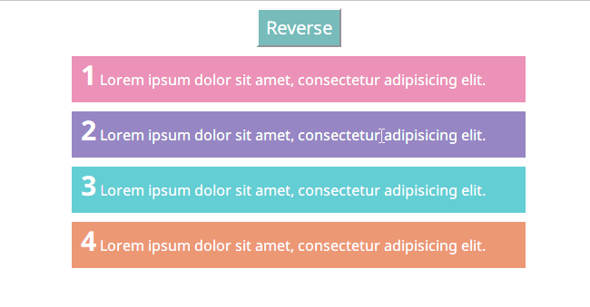

## Reverse the children of a DOM node

This demo shows how to reverse children of a DOM node without loosing their event listners and CSS styles. Checkout the `script.js`.

The first two version of `reverseChild` are tested on IE8, Chrome and Firefox, and should work on other versions of IE too.

The third one, which uses `Array.prototype.reverse()` and `Array.prototype.forEach()`, are tested on Chrome and Firefox.

These implementations all reverse the `childNodes` of the parent node, so text nodes and comment nodes will be reversed too.

### Notice

I use `onclick` to attach event listeners for this demo because I don't want to deal with `addEventListener` polyfills for IE8.

### Demo

The yellow text color is toggled by `click` listeners.

#### Odd number of children

### Even number of children

