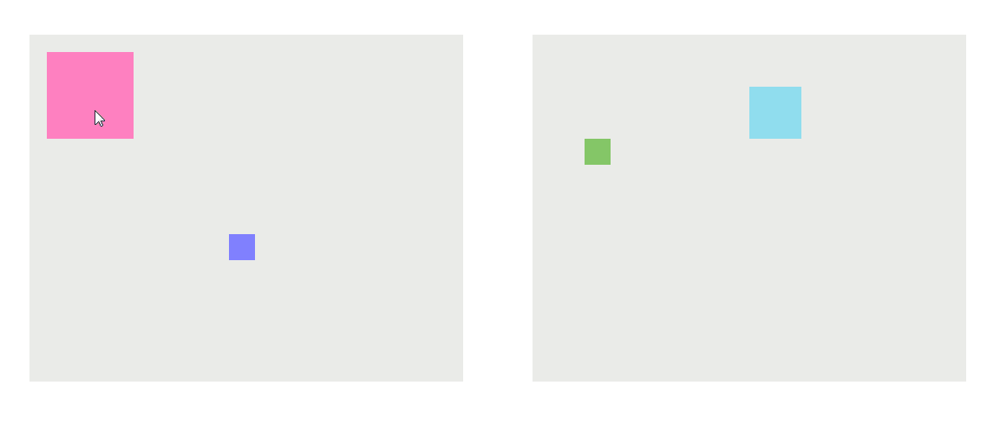

## Draggable

Cross-browser draggable implementation using vanilla JavaScript. Tested on IE7/8, Firefox, and Chrome. Should work with other versions of IE.

## Note

It used `pageX` and `pageY` (instead of `clientX` and `clientY`) to solve the problem where dragged object would jump when the page is already scrolled.

To eliminate the incorrect response when the cursor moves too fast, the mouse event is bound to the `body`.

This implementation also supports restricting the dragged object in its parent, as shown in the demo.

## Demo
